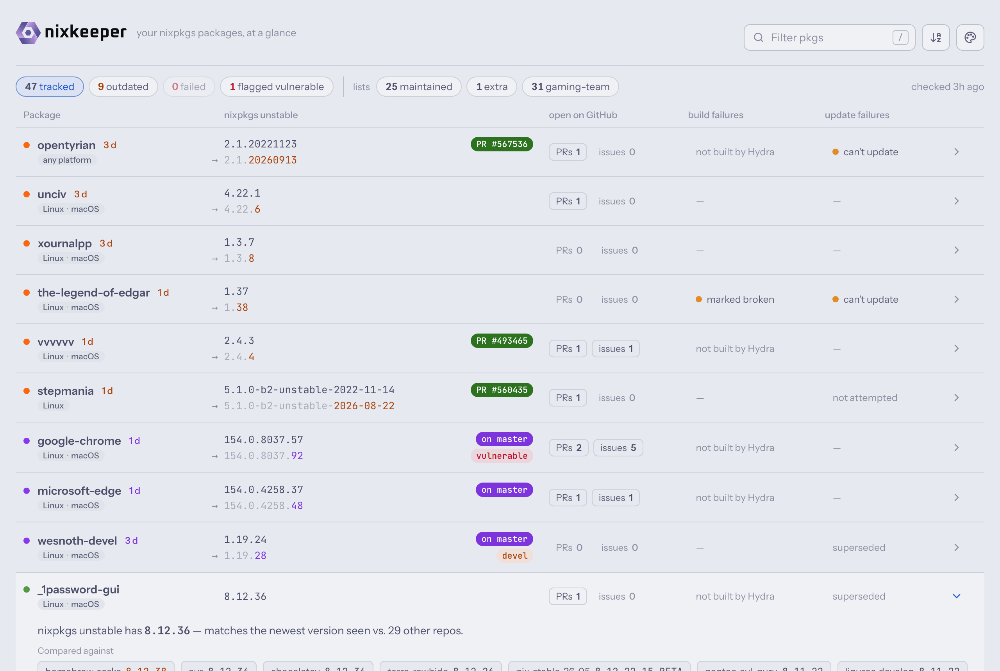
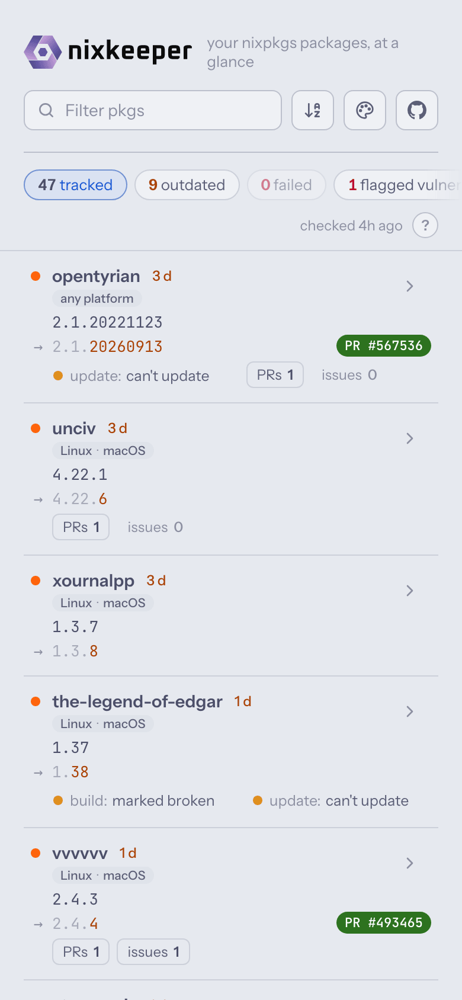
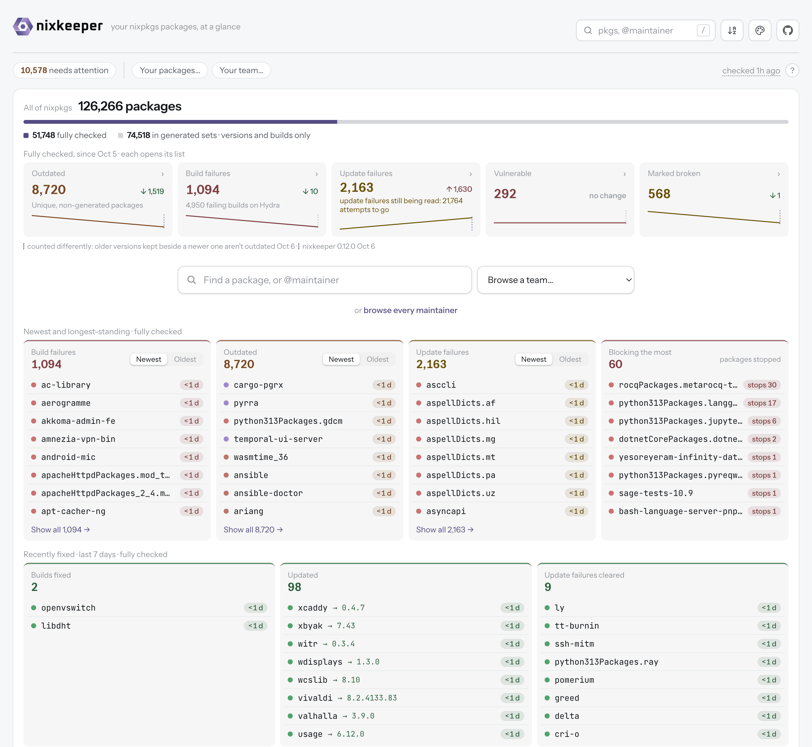
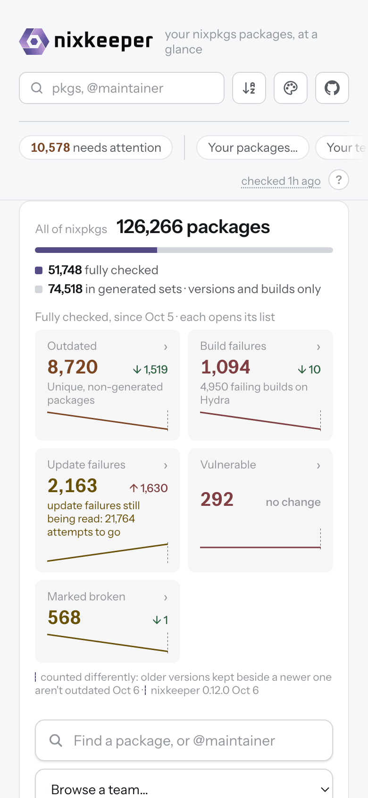
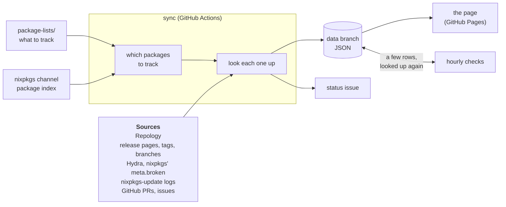

# <picture><source media="(prefers-color-scheme: dark)" srcset="assets/brand/nixkeeper-lockup-dark.svg"></picture>

[](https://github.com/iedame/nixkeeper/actions/workflows/ci.yml)
[](https://github.com/iedame/nixkeeper/actions/workflows/data-daily.yml)
[](https://github.com/iedame/nixkeeper/releases/latest)
[](https://nixkeeper.com/)

Health dashboard for the nixpkgs packages you maintain: new releases, build
and update failures, and vulnerabilities, in one place.

<p align="center">
  <picture>
    <source media="(prefers-color-scheme: dark)" srcset="assets/screenshots/desktop-dark.png">
    
  </picture>
  <picture>
    <source media="(prefers-color-scheme: dark)" srcset="assets/screenshots/mobile-dark.png">
    
  </picture>
</p>

<details>
<summary>The same in Catppuccin (Latte when light, Mocha when dark)</summary>
<br>
<p align="center">
  <picture>
    <source media="(prefers-color-scheme: dark)" srcset="assets/screenshots/desktop-dark-catppuccin.png">
    
  </picture>
  <picture>
    <source media="(prefers-color-scheme: dark)" srcset="assets/screenshots/mobile-dark-catppuccin.png">
    
  </picture>
</p>

Pick it in the page's Theme menu, or make it your page's default with
`page.theme = "catppuccin";` in your package lists.
</details>

For each package it tracks, nixkeeper shows on one static page (`page/`):

- **New releases**: whether nixpkgs unstable is behind, per
  [Repology](https://repology.org) and nixkeeper's own update checks (a
  project's tags, worked out from nixpkgs for those it fetches from GitHub,
  or a release page, or for unstable versions its branch;
  about hourly for the ones marked frequent)
- **Build failures**: [Hydra](https://hydra.nixos.org)'s latest builds on
  x86_64-linux, aarch64-linux and aarch64-darwin, and where nixpkgs marks it
  broken
- **Update failures**: the latest attempt of the
  [nixpkgs-update](https://nixpkgs-update-logs.nixos.org) bot (r-ryantm)
- **Vulnerabilities**: versions Repology flags, with their known CVEs
- **Open PRs and issues** in nixpkgs that name the package, with the update
  PR one click away: open (green), or merged and on master (violet)
  while it waits for the channel

A sync refreshes it all, daily (every 3 hours on nixkeeper.com). Any maintainer or team can get a GitHub
issue of their own, kept up to date and commenting when something newly
needs attention: [get notified](docs/notifications.md).

## The community dashboard

[The live dashboard](https://nixkeeper.com/) tracks
[every nixpkgs package](docs/all-packages.md), about 126,000, so anyone can
look theirs up without setting anything up. It opens on an overview of all
of nixpkgs: how many packages are outdated, failing to build, failing their
nixpkgs-update attempts, vulnerable or marked broken, with their trends;
the newest and longest-standing of each; the failing dependencies that stop
the most other builds; and what was fixed in the last week.

<p align="center">
  <picture>
    <source media="(prefers-color-scheme: dark)" srcset="assets/screenshots/overview-desktop-dark.png">
    
  </picture>
  <picture>
    <source media="(prefers-color-scheme: dark)" srcset="assets/screenshots/overview-mobile-dark.png">
    
  </picture>
</p>

**Finding yours.** Search for `@` and your GitHub handle, or link straight
to it: `https://nixkeeper.com/?maintainer=yourhandle`. A team's
packages are under "Browse a team" (`?team=gnome`), one package under
`?pkg=firefox`, and "needs attention" lists everything failing, outdated or
vulnerable. Every filter stays in the address, so a list ("my packages
failing on Darwin for over a month") is a link to share. "Your packages" and
"Your team" remember yours, in your browser only: there's no account.

**What's checked.** About 52,000 packages are fully checked: their
versions, builds, update attempts and open PRs and issues, read in bulk
rather than package by package. The sets updated in bulk (Haskell, R,
Emacs, TeX Live, Typst and SBCL packages, generated by their own tooling
from Hackage, CRAN and the like, not one PR per package) have Repology's
versions, Hydra's builds and the bot's attempts where it makes any, say
what updates them, and are counted per set rather than in the cards. To read all of nixpkgs politely, the bulk
of the data comes from five digests, each refreshed on its own schedule:
[nixkeeper-hydra](https://github.com/iedame/nixkeeper-hydra) (Hydra's
builds, and which dependency stopped one),
[nixkeeper-versions](https://github.com/iedame/nixkeeper-versions)
(Repology's versions),
[nixkeeper-updates](https://github.com/iedame/nixkeeper-updates)
(nixpkgs-update's attempts) and
[nixkeeper-vulnerabilities](https://github.com/iedame/nixkeeper-vulnerabilities)
(the NixOS security tracker's CVEs and OSV's advisories) and
[nixkeeper-prs](https://github.com/iedame/nixkeeper-prs) (nixpkgs' open PRs
and issues). "checked … ago", at the top of the page, says
how fresh each one is.

**Something wrong?** A version, build or update result that looks off:
[report it](https://github.com/iedame/nixkeeper/issues/new?template=something-looks-wrong.yml).
Where Repology has a version wrong, reporting it to Repology fixes it for
everyone; [community rules](docs/community.md) cover the meantime.

## How it works



There's no server: nixkeeper is a program that gathers data, and a static
page that shows it. [How it works](docs/how-it-works.md) explains each part;
[Reading the page](docs/reading-the-page.md) explains every dot and badge.

## Get started

**A dashboard of your own on GitHub.** Copy this repository, list your
GitHub handle and any other packages in `package-lists/`, and turn on
GitHub Pages: GitHub Actions syncs it daily, with nothing to host. See
[a dashboard of your own](docs/your-own-instance.md).

**The command, on your computer.**

```bash
nix run github:iedame/nixkeeper -- init --maintainer <your GitHub handle>
```

```bash
nix run github:iedame/nixkeeper -- sync
```

```bash
nix run github:iedame/nixkeeper -- serve
```

That starts your lists, syncs, and shows the page at http://127.0.0.1:8000/.
Installing it, its settings, and pinning a version:
[the nixkeeper command](docs/command.md).

**As a service.** The flake's modules run the sync and the checks on their
own, catch up after the machine was off, and serve the page:

```nix
services.nixkeeper = {
  enable = true;
  lists.maintainers = [ "your-github-handle" ];
};
```

See [nixkeeper on NixOS](docs/nixos.md) or
[nixkeeper on macOS](docs/darwin.md).

**Tried it?** [Tell us how it went](https://github.com/iedame/nixkeeper/issues/53):
how you run it, what was confusing, what's missing.

## Documentation

- [Reading the page](docs/reading-the-page.md): the dots, badges, panels and tab icon
- [Every package](docs/all-packages.md): the community dashboard's mode, and running one
- [How it works](docs/how-it-works.md): the sync, the sources, what gets tracked
- [A dashboard of your own](docs/your-own-instance.md): your own copy on GitHub
- [The nixkeeper command](docs/command.md): installing, settings, pinning a version
- [nixkeeper on NixOS](docs/nixos.md) and [on macOS](docs/darwin.md): the modules
- [Community rules](docs/community.md): shared update checks and ignore rules, opt-in
- [The data](docs/data.md): every field in the JSON, for building on it
- [Troubleshooting](docs/troubleshooting.md): checking that it all runs

## Contributing

How the code is laid out, the commands, and how changes and releases happen
are in [CONTRIBUTING.md](CONTRIBUTING.md); what changed in each version, in
[CHANGELOG.md](CHANGELOG.md). Security problems: [SECURITY.md](SECURITY.md).

## License

nixkeeper's code and its brand assets (`assets/brand/`) are released under
the [MIT License](LICENSE).

The published data (the `data` branch) is collected from other projects and
remains subject to their terms: [Repology](https://repology.org), nixpkgs'
[channel index](https://channels.nixos.org), [Hydra](https://hydra.nixos.org),
the [nixpkgs-update logs](https://nixpkgs-update-logs.nixos.org), GitHub, and
the release pages named in `package-lists/update-checks.nix`.

Fetching the nixpkgs-update logs follows the approach of
[nixpkgs-update-notifier](https://github.com/asymmetric/nixpkgs-update-notifier),
reimplemented here.
