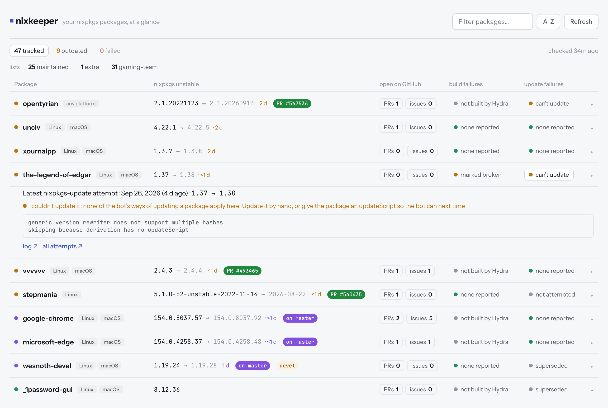
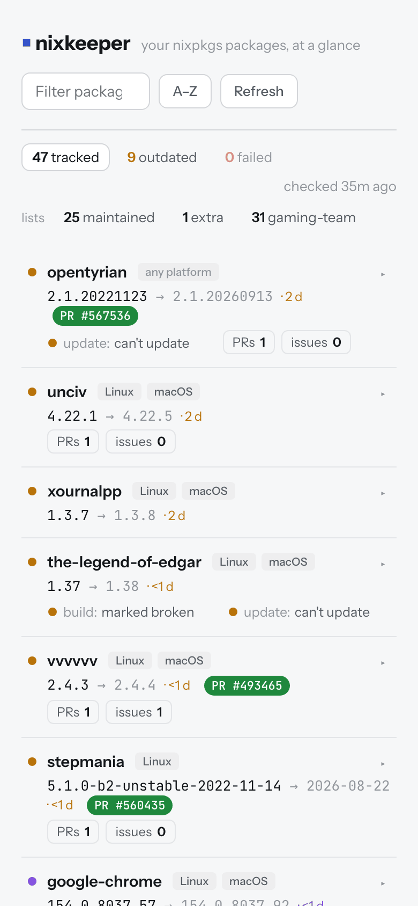

# nixkeeper

Health dashboard for the nixpkgs packages you maintain: new releases, build
and update failures, and vulnerabilities, in one place.

  <picture>
    <source media="(prefers-color-scheme: dark)" srcset="assets/desktop-dark.png">
    
  </picture>
  <picture>
    <source media="(prefers-color-scheme: dark)" srcset="assets/mobile-dark.png">
    
  </picture>

For each package it tracks, nixkeeper shows on one static page (`docs/`):

- **New releases**: whether nixpkgs unstable is behind, per
  [Repology](https://repology.org) and nixkeeper's own update checks (a
  project's tags or release page, or for unstable versions its branch;
  hourly for the ones marked frequent)
- **Build failures**: [Hydra](https://hydra.nixos.org)'s latest builds on
  x86_64-linux, aarch64-linux and aarch64-darwin, and where nixpkgs marks it
  broken
- **Update failures**: the latest attempt of the
  [nixpkgs-update](https://nixpkgs-update-logs.nixos.org) bot (r-ryantm)
- **Vulnerabilities**: versions Repology flags, with their known CVEs
- **Open PRs and issues** in nixpkgs that name the package, with the update
  PR one click away: open (GitHub's green), or merged and on master (purple)
  while it waits for the channel

A daily sync (GitHub Actions, or anywhere: see [Running elsewhere](#running-elsewhere))
refreshes it all and keeps a status issue up to date, commenting when something
newly needs attention.

## Reading the page

Each row is a package; clicking it opens its details (every repository
Repology compares it with, links to its homepage and nixpkgs source), and
clicking its build or update cell opens that instead. The counts at the top
(tracked, outdated, failed, and flagged vulnerable when any are) filter the
list, as do the list names under them and a row's platform tags; the filters
stay in the address, so a view can be shared.

**The dot** in front of each package:

| Dot | Means |
|---|---|
| green | up to date: nixpkgs has the newest version (for a devel package, the newest devel one), or is the only one packaging it |
| orange | outdated: Repology or nixkeeper's own update check knows a newer version |
| purple | outdated, but the update is already merged on master, waiting for nixos-unstable (usually a few days) |
| red | not in nixpkgs unstable (counted as failed) |
| grey | Repology can't compare the version: `untrusted`, `rolling`, `noscheme`, `incorrect` (shown as a badge) |

**The version**: nixpkgs unstable's, then for an outdated package `→` the
newer one and how long it's been outdated (`· 3d`). For an unstable version,
the target shows just the new date.

**Badges** after the version:

| Badge | Means |
|---|---|
| `PR #123` (green) | an open update PR in nixpkgs; grey while it's a draft |
| `on master` (purple) | the update is merged into master; links to its PR |
| `devel` | a development release, compared against other devel versions |
| `vulnerable` | Repology flags this version; the details link its known CVEs |
| `untrusted`, `rolling`, ... | Repology's status for a version it can't compare |
| `not refreshed` | Repology couldn't be reached on the last sync: older data |
| `check failing` | nixkeeper's own update check for it isn't working: fix it in `package-lists/update-checks.nix` |

**Build failures** (Hydra, which builds nixpkgs master):

| Shows | Means |
|---|---|
| failure reported (red) | its latest build failed on a platform: the panel links the log and says when it last built, and at which version |
| marked broken | nixpkgs marks it broken on a platform (known, so not counted as failed) |
| not built by Hydra | unfree, or kept off Hydra by nixpkgs |
| none reported | no failure of its own; a failed dependency or an unfinished build shows only in the panel |

**Update failures** (the nixpkgs-update bot, r-ryantm; its latest attempt):

| Shows | Means |
|---|---|
| failure reported (red) | the bot's update failed: the panel shows the end of its log |
| can't update (amber) | a newer version exists, but none of the bot's ways of updating apply to this package: update it by hand, or give it an updateScript |
| superseded | the attempt no longer matters: nixpkgs has moved past that version (in the channel, or merged on master), or a manual rule ignores it (`package-lists/ignored-updates.nix`) |
| not attempted | the bot has never tried this package |
| none reported | the bot opened a PR, found one open, or had nothing to update |

A `not refreshed` tag on a build or update cell means Hydra or the update
logs couldn't be reached on the last sync, so it shows the last known result.
The time at the top right is the last sync; it turns red when that was over
two days ago.

## What gets tracked

`package-lists/default.nix` lists GitHub handles under `maintainers` (every
nixpkgs package they maintain is tracked) and imports further named lists
under `extraPackages` (`extra`, `gaming-team`, ...) of nixpkgs attribute names
(exactly that package, e.g. `haskellPackages.pandoc`) or pnames (every
top-level package with that pname).

Each list is a filter on the page, next to `maintained` for the packages
found through `maintainers`. `?list=gaming-team` in the address is a page of
just that list, to share with the people it's for.

## Track your own packages

This repository is one instance, tracking iedame's packages and the NixOS
gaming team's. To get a dashboard of your own:

1. **Copy the repository**: "Use this template" on GitHub gives you a clean
   copy (none of this instance's history or data), or fork it (a fork starts
   with its workflows off: turn them on in its Actions tab).
2. **Say what to track** in `package-lists/`:
   - `default.nix`: your GitHub handle under `maintainers`, and your own
     named lists under `extraPackages` (or none);
   - `update-checks.nix` and `ignored-updates.nix`: empty them (`{ }`) or
     replace the entries. They name this instance's packages, and
     `nix flake check` fails on entries for packages you don't track.
3. **Turn on GitHub Pages**: Settings → Pages → Deploy from a branch: `main`,
   folder `/docs`. The page is then at `https://<you>.github.io/<repo>/`.
4. **Run the first sync**: Actions → "Data: daily sync" → Run workflow. It
   takes a few minutes, creates the `data` branch, and opens the status issue
   (labelled `nixkeeper-status`) that the syncs keep up to date. The page
   finds the data by itself; from then on the sync runs daily at 06:00 UTC,
   and the hourly workflow looks for update PRs.
5. **Optionally**, add your own [update checks](package-lists/update-checks.nix)
   and [ignore rules](package-lists/ignored-updates.nix), each documented in
   its file, and update this README's badges and screenshots to point at your
   instance.

The workflows need no secrets: they use the token GitHub gives each run, with
the permissions each workflow declares. GitHub pauses scheduled workflows in
public repositories without activity for 60 days; if the data stops
updating, re-enable the workflow in the Actions tab.

To run it somewhere other than GitHub Actions, see
[Running elsewhere](#running-elsewhere).

## Running elsewhere

Everything defaults to running from a checkout with the GitHub workflows.
Elsewhere (a server, a service), these environment variables change that:

| Variable | Default | What it sets |
|---|---|---|
| `NIXKEEPER_DATA_DIR` | `data` | where the data is written, and the previous run read from |
| `NIXKEEPER_LISTS` | `package-lists` | the package lists: that Nix folder, or a JSON file of what it evaluates to |
| `NIXKEEPER_GITHUB_TOKEN_FILE` | – | a file holding a GitHub token (else `GITHUB_TOKEN`, else the local `gh` login) |
| `NIXKEEPER_NOTIFY` | `none` | `github-issue` to keep the status issue up to date (the workflows set it) |
| `NIXKEEPER_GITHUB_REPO` | the workflow's repo | where the status issue lives |
| `NIXKEEPER_PAGE_URL` | the GitHub Pages site | the page link in notifications |

The status issue is only posted with a token given explicitly (the token file
or `GITHUB_TOKEN`), never with the local `gh` login.

The page finds its data by itself when `data/` is served next to it. Otherwise
it reads the repository's `data` branch on a GitHub Pages site, or wherever
`<meta name="nixkeeper-data" content="…">` in `docs/index.html` points.
`?data=<url>` (same site only) overrides it for testing.

## The data

Everything the page shows is plain JSON on the `data` branch, updated by each
sync: `data/index.json`, one row per package, plus each project's raw
Repology data. [DATA.md](DATA.md) describes every field, for building
something else on it.

## Contributing

How the code is laid out, the commands, and how changes and releases happen
are in [CONTRIBUTING.md](CONTRIBUTING.md). Security problems:
[SECURITY.md](SECURITY.md).

## License

nixkeeper's code is released under the [MIT License](LICENSE).

The published data (the `data` branch) is collected from other projects and
remains subject to their terms: [Repology](https://repology.org), nixpkgs'
[channel index](https://channels.nixos.org), [Hydra](https://hydra.nixos.org),
the [nixpkgs-update logs](https://nixpkgs-update-logs.nixos.org), GitHub, and
the release pages named in `package-lists/update-checks.nix`.

Fetching the nixpkgs-update logs follows the approach of
[nixpkgs-update-notifier](https://github.com/asymmetric/nixpkgs-update-notifier),
reimplemented here.
