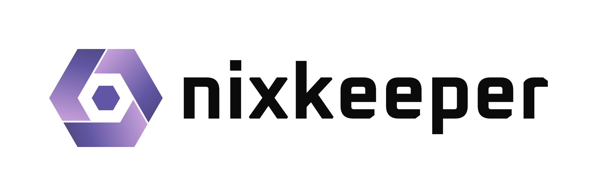
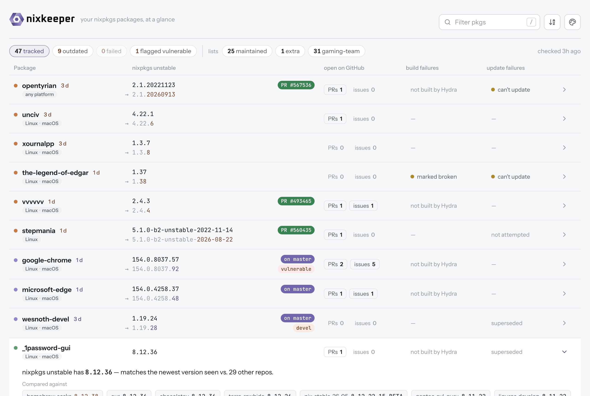
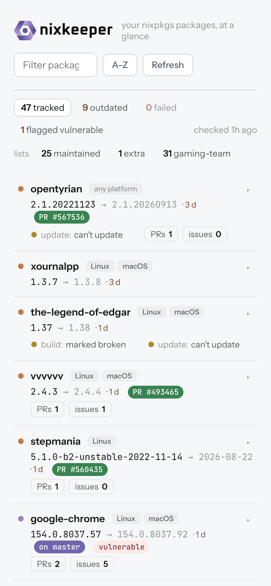
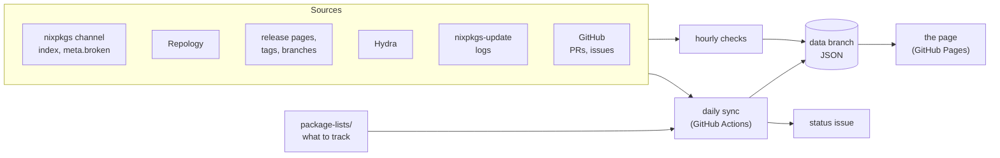

# <picture><source media="(prefers-color-scheme: dark)" srcset="assets/brand/nixkeeper-lockup-dark.svg"></picture>

[](https://github.com/iedame/nixkeeper/actions/workflows/ci.yml)
[](https://github.com/iedame/nixkeeper/actions/workflows/data-daily.yml)
[](https://github.com/iedame/nixkeeper/releases/latest)
[](https://iedame.github.io/nixkeeper/)

Health dashboard for the nixpkgs packages you maintain: new releases, build
and update failures, and vulnerabilities, in one place.

<p align="center">
  <picture>
    <source media="(prefers-color-scheme: dark)" srcset="assets/screenshots/desktop-dark.png">
    
  </picture>
  <picture>
    <source media="(prefers-color-scheme: dark)" srcset="assets/screenshots/mobile-dark.png">
    
  </picture>
</p>

For each package it tracks, nixkeeper shows on one static page (`docs/`):

- **New releases**: whether nixpkgs unstable is behind, per
  [Repology](https://repology.org) and nixkeeper's own update checks (a
  project's tags or release page, or for unstable versions its branch;
  about hourly for the ones marked frequent)
- **Build failures**: [Hydra](https://hydra.nixos.org)'s latest builds on
  x86_64-linux, aarch64-linux and aarch64-darwin, and where nixpkgs marks it
  broken
- **Update failures**: the latest attempt of the
  [nixpkgs-update](https://nixpkgs-update-logs.nixos.org) bot (r-ryantm)
- **Vulnerabilities**: versions Repology flags, with their known CVEs
- **Open PRs and issues** in nixpkgs that name the package, with the update
  PR one click away: open (green), or merged and on master (violet)
  while it waits for the channel

A daily sync (GitHub Actions, or anywhere: see [Running elsewhere](#running-elsewhere))
refreshes it all and keeps a status issue up to date, commenting when something
newly needs attention.

## How it works



There's no server: nixkeeper is a program that gathers data, and a static
page that shows it.

- **The daily sync** (`nix run .#sync`, run by the "Data: daily sync"
  workflow at 06:00 UTC) works out which packages to track from
  `package-lists/` and the nixos-unstable channel's package index, then asks
  each source about them: Repology for versions, nixkeeper's own update
  checks, Hydra for builds (and nixpkgs for where it marks them broken), the
  nixpkgs-update logs for the bot's latest attempt, and GitHub for open PRs,
  issues and update PRs. It writes everything as JSON to the `data` branch
  ([DATA.md](DATA.md)) and rewrites the status issue, commenting when
  something newly needs attention.
- **The hourly checks** ("Data: hourly updates") refresh a few rows of the
  last published data: the update checks marked `frequent` (browsers, for
  their security fixes) and outdated packages' update PRs. They commit only
  when something changed. GitHub runs scheduled workflows on a best-effort
  basis, so "hourly" can stretch to a few hours when Actions is busy; the
  daily sync still covers everything.
- **The page** (`docs/`, served by GitHub Pages) is plain HTML and
  JavaScript that reads the JSON in your browser.

When a source can't be reached, the row keeps its last known result, marked
as not refreshed, and the status issue says so; the rest of the sync goes
on. If most Repology lookups fail, the sync stops and leaves the published
data as it was.

## Reading the page

Each row is a package; clicking it opens its details (every repository
Repology compares it with, links to its homepage and nixpkgs source), and
clicking its build or update cell opens that instead. The counts at the top
(tracked, outdated, failed, and flagged vulnerable when any are) filter the
list, as do the list names under them and a row's platform tags; the filters
stay in the address, so a view can be shared.

**The dot** in front of each package:

| Dot | Means |
|---|---|
| green | up to date: nixpkgs has the newest version (for a devel package, the newest devel one), or is the only one packaging it |
| orange | outdated: Repology or nixkeeper's own update check knows a newer version |
| violet | outdated, but the update is already merged on master, waiting for nixos-unstable (usually a few days) |
| pink | not in nixpkgs unstable (counted as failed) |
| grey | Repology can't compare the version: `untrusted`, `rolling`, `noscheme`, `incorrect` (shown as a badge) |

**The version**: nixpkgs unstable's, then for an outdated package `→` the
newer one and how long it's been outdated (`· 3d`). For an unstable version,
the target shows just the new date.

**Badges** after the version:

| Badge | Means |
|---|---|
| `PR #123` (green) | an open update PR in nixpkgs; grey while it's a draft |
| `on master` (violet) | the update is merged into master; links to its PR |
| `devel` | a development release, compared against other devel versions |
| `vulnerable` | Repology flags this version; the details link its known CVEs |
| `untrusted`, `rolling`, ... | Repology's status for a version it can't compare |
| `not refreshed` | Repology couldn't be reached on the last sync: older data |
| `check failing` | nixkeeper's own update check for it isn't working: fix it in `package-lists/update-checks.nix` |

**Build failures** (Hydra, which builds nixpkgs master):

| Shows | Means |
|---|---|
| failure reported (pink) | its latest build failed on a platform: the panel links the log and says when it last built, and at which version |
| marked broken (gold) | nixpkgs marks it broken on a platform (known, so not counted as failed) |
| not built by Hydra | unfree, or kept off Hydra by nixpkgs |
| none reported | no failure of its own; a failed dependency or an unfinished build shows only in the panel |

**Update failures** (the nixpkgs-update bot, r-ryantm; its latest attempt):

| Shows | Means |
|---|---|
| failure reported (pink) | the bot's update failed: the panel shows the end of its log |
| can't update (gold) | a newer version exists, but none of the bot's ways of updating apply to this package: update it by hand, or give it an updateScript |
| superseded | the attempt no longer matters: nixpkgs has moved past that version (in the channel, or merged on master), or a manual rule ignores it (`package-lists/ignored-updates.nix`) |
| not attempted | the bot has never tried this package |
| none reported | the bot opened a PR, found one open, had nothing to update, or finished without a recognisable result (the panel says which) |

A `not refreshed` tag on a build or update cell means Hydra or the update
logs couldn't be reached on the last sync, so it shows the last known result.
The time at the top right is the last sync; it turns pink when that was over
two days ago.

**The tab's icon** shows what needs attention, so a pinned tab tells you at a
glance: each of the mark's three chevrons lights up for its own signal, the
top right orange for a new release (not counting updates already on master),
the left pink for a failure, the bottom pink for a vulnerability. With none,
the top right is green: all good. It follows the list filter, like the counts.

## What gets tracked

`package-lists/default.nix` lists GitHub handles under `maintainers` (every
nixpkgs package they maintain is tracked) and imports further named lists
under `extraPackages` (`extra`, `gaming-team`, ...) of nixpkgs attribute names
(exactly that package, e.g. `haskellPackages.pandoc`) or pnames (every
top-level package with that pname).

Each list is a filter on the page, next to `maintained` for the packages
found through `maintainers`. `?list=gaming-team` in the address is a page of
just that list, to share with the people it's for.

## Track your own packages

This repository is one instance, tracking iedame's packages and the NixOS
gaming team's. To get a dashboard of your own:

1. **Copy the repository**: "Use this template" on GitHub gives you a clean
   copy (none of this instance's history or data), or fork it (a fork starts
   with its workflows off: turn them on in its Actions tab).
2. **Say what to track** in `package-lists/`:
   - `default.nix`: your GitHub handle under `maintainers`, and your own
     named lists under `extraPackages` (or none);
   - `update-checks.nix` and `ignored-updates.nix`: empty them (`{ }`) or
     replace the entries. They name this instance's packages, and
     `nix flake check` fails on entries for packages you don't track.
3. **Turn on GitHub Pages**: Settings → Pages → Deploy from a branch: `main`,
   folder `/docs`. The page is then at `https://<you>.github.io/<repo>/`.
4. **Run the first sync**: Actions → "Data: daily sync" → Run workflow. It
   takes a few minutes, creates the `data` branch, and opens the status issue
   (labelled `nixkeeper-status`) that the syncs keep up to date. The page
   finds the data by itself; from then on the sync runs daily at 06:00 UTC,
   and the hourly workflow looks for update PRs.
5. **Optionally**, add your own [update checks](package-lists/update-checks.nix)
   and [ignore rules](package-lists/ignored-updates.nix), each documented in
   its file, and update this README's badges to point at your instance.
   Retake the screenshots of your own page with
   `nix run .#screenshots -- --browser google-chrome` (see
   [CONTRIBUTING.md](CONTRIBUTING.md#screenshots) for the options).

The workflows need no secrets: they use the token GitHub gives each run, with
the permissions each workflow declares. GitHub pauses scheduled workflows in
public repositories without activity for 60 days; if the data stops
updating, re-enable the workflow in the Actions tab.

To run it somewhere other than GitHub Actions, see
[Running elsewhere](#running-elsewhere).

## Running elsewhere

nixkeeper is one command, `nixkeeper`, with a subcommand for each job:

```bash
nixkeeper init --maintainer <your GitHub handle>   # start your package lists
nixkeeper sync            # one full sync
nixkeeper frequent-check  # only the update checks marked frequent
nixkeeper pr-check        # outdated packages' update PRs
nixkeeper paths           # where the lists and data are, and which setting says so
nixkeeper serve           # show the page on this computer (http://127.0.0.1:8000/)
nixkeeper page <dir>      # write the page and the data into a folder, to host anywhere
```

Without installing it, `nix run github:iedame/nixkeeper -- <command>` runs
the same. The old names (`nixkeeper-sync`, ...) still work until 1.0.

On its own, it keeps your lists in `~/.config/nixkeeper/package-lists/`
(`nixkeeper init` starts them) and the data in
`~/.local/state/nixkeeper/data/` (following `$XDG_CONFIG_HOME` and
`$XDG_STATE_HOME`). From a checkout, `nix run .#sync` (and
`.#frequent-check`, `.#pr-check`) use the checkout's `package-lists/` and
`data/` instead, as the GitHub workflows do. Flags or environment variables
choose others; a flag wins over its variable:

| Flag | Variable | Default | What it sets |
|---|---|---|---|
| `--data-dir` | `NIXKEEPER_DATA_DIR` | `~/.local/state/nixkeeper/data` | where the data is written, and the previous run read from |
| `--lists` | `NIXKEEPER_LISTS` | `~/.config/nixkeeper/package-lists` (or `lists.json` there) | the package lists: that Nix folder, or a JSON file of what it evaluates to |
| | `NIXKEEPER_GITHUB_TOKEN_FILE` | – | a file holding a GitHub token (else `GITHUB_TOKEN`, else the local `gh` login) |
| `--notify` | `NIXKEEPER_NOTIFY` | `none` | `github-issue` to keep the status issue up to date (the workflows set it) |
| | `NIXKEEPER_GITHUB_REPO` | the workflow's repo | where the status issue lives |
| | `NIXKEEPER_PAGE_URL` | the GitHub Pages site | the page link in notifications |
| | `REPOLOGY_BASE_URL` | – | one Repology address to use (normally `repology.org`, falling back to its mirror `repology.amdmi3.ru`) |

The status issue is only posted with a token given explicitly (the token file
or `GITHUB_TOKEN`), never with the local `gh` login. Reading from GitHub (PR
and issue counts, update PRs) does use the `gh` login when there's no other
token.

The page ships with the command (and in the package's
`share/nixkeeper/www/`). `nixkeeper serve` shows it with the data as it is,
so a new sync appears on the next reload; it listens on this computer only
unless `--bind` says otherwise. `nixkeeper page <dir>` writes a folder for
any static host, with the data copied in as `data/`; run it again after
each sync. It only writes into a new or empty folder, or one it wrote
before.

The page finds its data by itself when `data/` is served next to it. Otherwise
it reads the repository's `data` branch on a GitHub Pages site, or wherever
`<meta name="nixkeeper-data" content="…">` in `docs/index.html` points.
`?data=<url>` (same site only) overrides it for testing.

## The data

Everything the page shows is plain JSON on the `data` branch, updated by each
sync: `data/index.json`, one row per package, plus each project's raw
Repology data. [DATA.md](DATA.md) describes every field, for building
something else on it.

## Contributing

How the code is laid out, the commands, and how changes and releases happen
are in [CONTRIBUTING.md](CONTRIBUTING.md). Security problems:
[SECURITY.md](SECURITY.md).

## License

nixkeeper's code and its brand assets (`assets/brand/`) are released under
the [MIT License](LICENSE).

The published data (the `data` branch) is collected from other projects and
remains subject to their terms: [Repology](https://repology.org), nixpkgs'
[channel index](https://channels.nixos.org), [Hydra](https://hydra.nixos.org),
the [nixpkgs-update logs](https://nixpkgs-update-logs.nixos.org), GitHub, and
the release pages named in `package-lists/update-checks.nix`.

Fetching the nixpkgs-update logs follows the approach of
[nixpkgs-update-notifier](https://github.com/asymmetric/nixpkgs-update-notifier),
reimplemented here.
